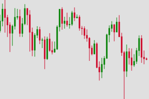
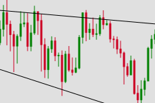

# Trendline

Trendline is a Python library designed for automatic estimation of financial asset price trendlines.


## Installation

You can install the `trendline` library using pip:

```bash
pip install trendline
```

## Example Use

### Fetching Example Data

```python
import pandas as pd
import yfinance as yf

# Set the start and end dates
start_date = "2024-01-01"
end_date = "2024-09-01"

# Fetch Bitcoin data from Yahoo Finance
bitcoin = yf.download('BTC-USD', start=start_date, end=end_date)

# Ensure that the index is a DatetimeIndex
bitcoin.index = pd.to_datetime(bitcoin.index)

# Resample the data to a 2-day frequency and aggregate OHLC values
bitcoin = bitcoin.resample('3D').agg({
    'Open': 'first',
    'High': 'max',
    'Low': 'min',
    'Close': 'last'
})[-60:]
```

Initial price chart:




### Calculating Trendlines for a Single Asset
For a single asset, use the `calculate_trendline` function. This function calculates support and resistance trendlines based on the provided DataFrame.

Parameters:
- `dataframe (DataFrame)` : A DataFrame containing financial data for a single asset.
- `num_chunks (int, optional)` : Number of chunks to divide residuals into (default is 5).
- `residual_percentile (int, optional)` : Percentile for calculating residual cutoffs (default is 10).

Returns:
A dictionary containing trendline data for the single asset, including:
- `support_first_value`: First value of the support trendline.
- `support_last_value`: Last value of the support trendline.
- `support_gradient`: Gradient of the support trendline.
- `resistance_first_value`: First value of the resistance trendline.
- `resistance_last_value`: Last value of the resistance trendline.
- `resistance_gradient`: Gradient of the resistance trendline.

```python
from trendline import calculate_trendline

# Calculate support and resistance line
trend_line = calculate_trendline(bitcoin)

print(trend_line)
```

Output
```python
{
  'support_first_value': 61290.158653846156, 
  'support_last_value': 49481.25901442308, 
  'support_gradient': -200.1508413461538, 
  'resistance_first_value': 71895.0775082237, 
  'resistance_last_value': 68705.86307565791, 
  'resistance_gradient': -54.054481907894726
}
```

### Visualize Trendline
You can then visualize the trendline using data visualization library like `trendline`.

```python
from trendline import calculate_trendline
from fsplot import plot_candlestick_trendline

# Calculate trendline
trend_line = calculate_trendline(bitcoin)


# Prepare data for plotting
data = {
    "Open": bitcoin["Open"],
    "High": bitcoin["High"],
    "Low": bitcoin["Low"],
    "Close": bitcoin["Close"],
    "support_first_value": trend_line["support_first_value"],
    "support_gradient": trend_line["support_gradient"],
    "resistance_first_value": trend_line["resistance_first_value"],
    "resistance_gradient": trend_line["resistance_gradient"]
  }

  # Generate and display the candlestick plot
  svg = plot_candlestick_trendline(data)

  with open("candlestick_trendline.svg", "w") as file:
    file.write(svg)
```

Output




### Calculating Trendlines for Multiple Assets
If you have data for multiple assets, use the `calculate_multiple_trendlines` function. This function calculates support and resistance trendlines for each asset in a dictionary of DataFrames.

Parameters:
- `dataframes (dict)`: Dictionary where keys are asset identifiers and values are DataFrames containing financial data for each asset.
- `num_chunks (int, optional)` : Number of chunks to divide residuals into (default is 5).
- `residual_percentile (int, optional)` : Percentile for calculating residual cutoffs (default is 10).

Returns:
A dictionary where keys are asset identifiers and values are dictionaries containing trendline data for each asset, including:
- `support_first_value`: First value of the support trendline.
- `support_last_value`: Last value of the support trendline.
- `support_gradient`: Gradient of the support trendline.
- `resistance_first_value`: First value of the resistance trendline.
- `resistance_last_value`: Last value of the resistance trendline.
- `resistance_gradient`: Gradient of the resistance trendline.


Example
```python
import pandas as pd
import yfinance as yf
from trendline import calculate_multiple_trendlines

# Set the start and end dates
start_date = "2024-01-01"
end_date = "2024-09-01"

# Fetch Bitcoin data from Yahoo Finance
bitcoin = yf.download('BTC-USD', start=start_date, end=end_date)

# Fetch Bitcoin data from Yahoo Finance
ethereum = yf.download('ETH-USD', start=start_date, end=end_date)

data={
  "bitcoin":bitcoin,
  "ethereum":ethereum
}

multiple_trendlines = calculate_multiple_trendlines(data)
print(multiple_trendlines)

```

Output
```python
{
  'bitcoin': 
  {
    'support_first_value': 41460.49592550204,
    'support_last_value': 59401.33995907945,
    'support_gradient': 73.83063388303462,
    'resistance_first_value': 74427.21580630442,
    'resistance_last_value': 65303.645883028614,
    'resistance_gradient': -37.545555239818135
  },
 
 'ethereum': 
 {
    'support_first_value': 2335.8713278169453,
    'support_last_value': 2552.775168729424,
    'support_gradient': 0.8926083988167839,
    'resistance_first_value': 4267.282737989803,
    'resistance_last_value': 3473.1311736899124,
    'resistance_gradient': -3.2681134333328807
  }
}
```


